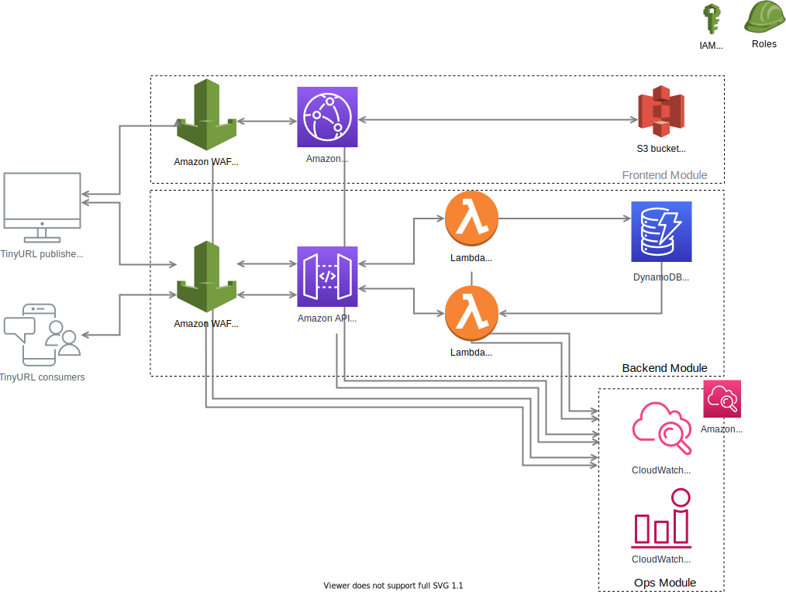

# TinyURL Serverless Application

TinyURL Serverless Application is now running on <https://tinyurl.tech>. URL shortening solutions are important for optimising links readability, tracking links and analysing audiences.

The TinyURL Serverless Application has the primary objective as a URL shortening application built for highly scalability and reliability yet low maintenance from onset. The project captures key architectural advantages that comes with severless approach to applications. It comprises of infrastructure components, code structure, deployment techniques, testing approaches, and operational practices for a production-grade AWS based solution.

Written in Node.JS, CloudFormation and built using the AWS Serverless Application Model. It is comprised of these components:

1. Frontend component - S3 Static Single Page App served via Amazon Cloudfront behind WAF

2. Backend component - DynamoDB as Storage, Lambda function serving business logics and API Gateway behind WAF as REST API endpoint for requests

3. Ops component - CloudWatch implemented with Logging and Alarms creating alerts on abnormalty

## Goal

Functional requirements:

- To collect from users URL via UI, shorten URL with unique id and return shortened URL
- To fulfil on calling shortened URL, permanent redirection with status code 301 to original URL

Non-functional requirements:

- To prevent single point of failure and guard against attacks including unapproved access
- To serve at high service levels as requirement. All the URL redirections fail if service fail.
- To scale application up and down readily based on traffic and prevents inefficiency
- To reduce cost exposure through architecture design and resource scaling management

Extended requirements:

- To be accessible via API
